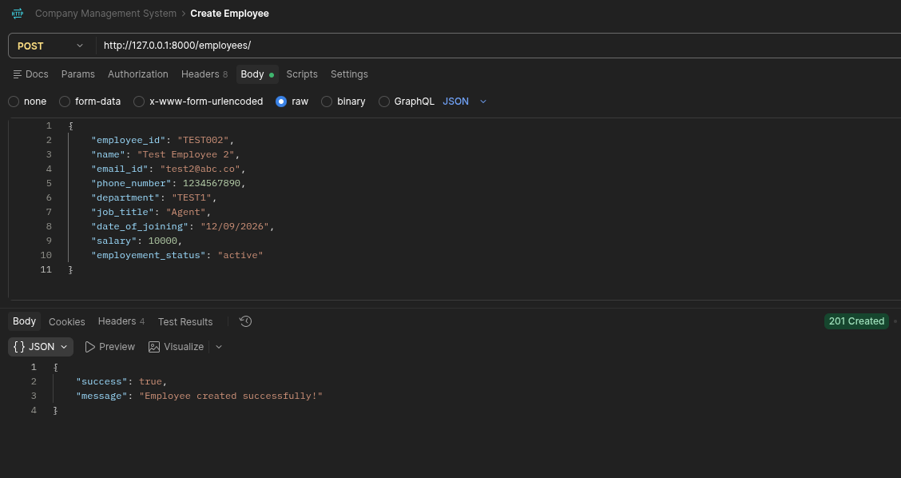
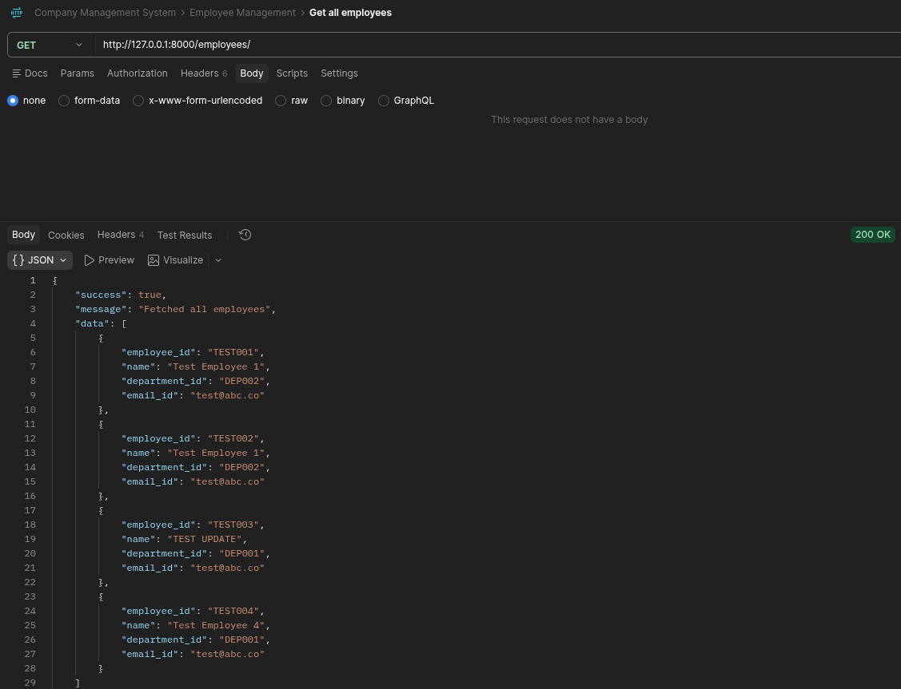
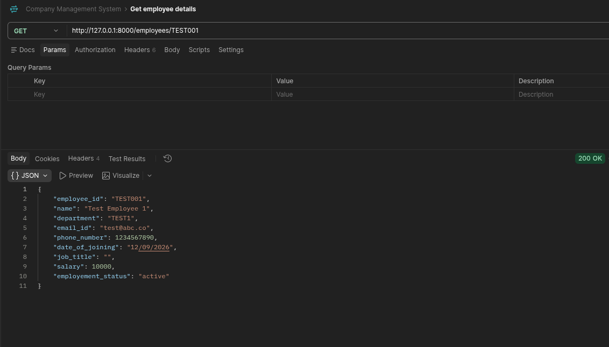
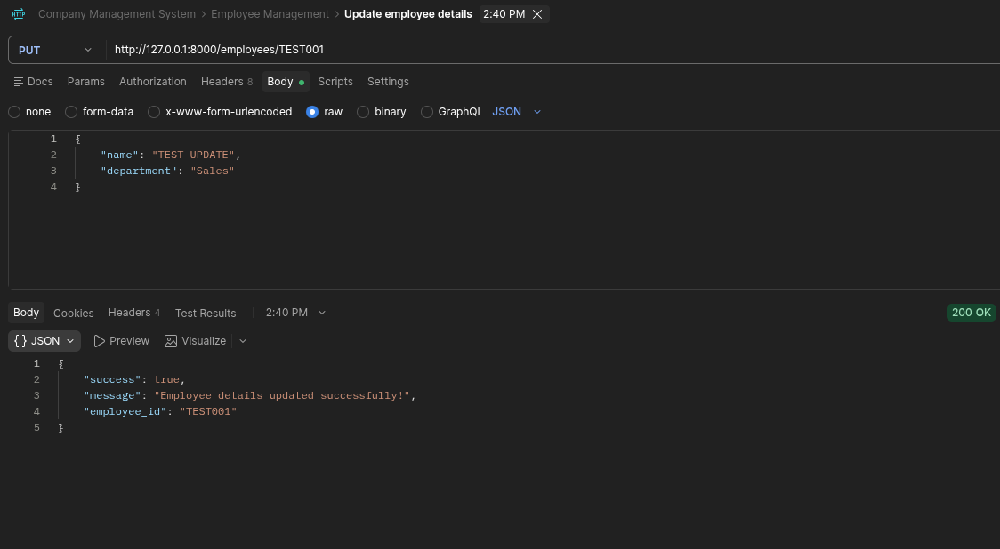
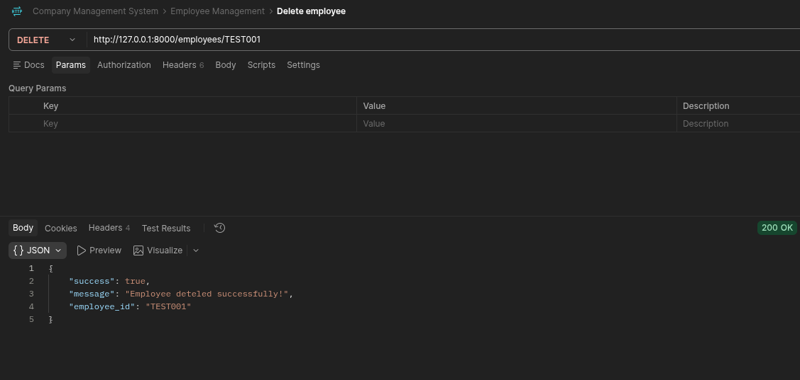

# CompanyManagementSystem
The **Company Management System** is a web-based management system designed to help companies manage employees, departments, attendance, leave, payroll and other internal operations from a centralised platform. 

The project is being developed using **FastAPI** and **MongoDB**, with additional modules planned throughout the development period.

## Tech Stack
| Technology | Purpose |
|------------|---------|
| Python | Backend Language |
| FastAPI | REST API framework |
| MongoDB | Database |
| PyMongo | MongoDB integration | 
| Uvicorn | Development Server |
| python-dotenv | Environment variable management |

## Employee Management
**Employee Management** is the first completed module of the system.

It provides the basic CRUD operations for managing employee records.

### Features:
- Create Employees
- View all employees
- View individual employee
- Update employee information
- Delete employees
- Search employees

### Employee Information
An employee record currently contains:
```text
Employee ID
Name
Email ID
Phone Number
Department
Job Title
Salary
Date of Joining
Employement Status
```

## API Endpoints
### Get all employees
```http
GET /employees/
```
Returns a list of employees with basic information.

Example:
```JSON
{
    "success": true,
    "message": "Fetched all employees",
    "data": [
        {
            "employee_id": "EMP001",
            "name": "John Doe",
            "email": "john.doe@example.com",
            "department": "Sales"
        }
    ]
}
```

### Get an employee
```http
GET /employees/{employee_id}
```
Returns detailed information about a specific employee.

### Create an employee
```http
POST /employees/
```

Example request:
```JSON
{
    "employee_id": "EMP001",
    "name": "John Doe",
    "email_id": "john.doe@example.com",
    "phone_number": 1234567890,
    "department": "Sales",
    "job_title": "Sales Executive",
    "date_of_joining": "2026-09-12",
    "salary": 14000,
    "employement_status": "active"
}
```

### Update an employee
```http
PUT /employees/{employee_id}
```
Updates information for an existing employee

### Delete an employee
```http
DELETE /employees/{employee_id}
```
Deletes an employee record.

## Running the project
### 1. Clone the repository
```bash
git clone https://github.com/hasancooksfr/CompanyManagementSystem
cd CompanyManagementSystem
```

### 2. Install dependencies
```bash
pip install -r requirements.txt
```

### 3. Configure environment variables
Create an `.env` file:
```env
MONGO_URI=your_mongodb_connection_string
```

### 4. Start the server
```bash
cd app
uvicorn main:app --reload
```

The API will be available at:
```
http://127.0.0.1:8000
```

### Postman Collection

Postman collection for *Employee Management* can be found [here](https://www.postman.com/hasancooksreal-6713011/workspace/company-management-system/folder/50773921-650d8361-e262-42f9-b1ce-390f0eeb11bf?action=share&creator=50773921). **Please run server first to test all the commands smoothly**.


## Screenshots
### Employee Creation


### Get all employees


### Get employee details


### Update employee details


### Delete employee details


## Testing
The employee management system has been tested for:
- Creating employee records
- Retrieving employee records
- Updating employee records
- Deleting employee records 
- Invalid employee data
- Duplicate employee IDs